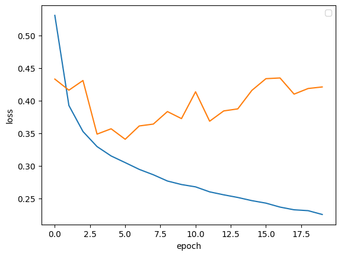

# 참고한 지민's colab
https://colab.research.google.com/drive/1h-IR8SOIP8Awiku3MjVxGPbMJxhVWmRt?usp=sharing#scrollTo=FsBAxgIIYdKH

나와 똑같은 노트북을 보고 필사했지만, 서로 집중한 부분이 달라서 배울 점이 있었다.

# ANN
ANN에 대한 기본적인 개념 정리(from 선희's blog)

[ANN 기본 개념 정리]
https://sunnydadiary.tistory.com/46

[KAGGLE - ANN정리]
https://sunnydadiary.tistory.com/47

## ANN에서 LabelEncoder를 사용하는 이유
필사 코랩에 "모든 변수들에 LabelEncoder를 적용하는 이유가 궁금하다. 그래도 성능에 무관할까?" 라는 궁금증을 적어두었는데, 이 부분을 지민이의 설명을 통해서 해소할 수 있었다. 

1. ANN은 각 값을 벡터화하기 때문에 숫자는 단순히 인덱스가 되고, 서열의 의미가 미미해진다.
내부적으로 비선형 변환이 들어가서 0, 1, 2 사이의 단순한 수치적 차이가 크게 의미 없을 수 있다.

2) 범주 수가 너무 많거나 너무 적은 경우에 one-hot 은 너무 비효율적이다.
    
     이 경우 LabelEncoder + Embedding layer 가 더 효율적

3) 트리 모델은 숫자 간 비교 연산을 하므로 LabelEncoder가 잘못된 순서 정보를 줄 수 있어서 유의해야한다. 하지만 ANN은 모델 트리 기반이 아닌 딥러닝이라서 비교 연산보다 가중치 학습에 집중하는 모델이기에, 숫자값이 상대적으로 덜 중요할 수 있다.

## ANN모델의 과적합

### 데이터셋의 구성

> 출처: fastcampus

- 학습 데이터 : 학습 과정에 보여지고, 실제 모델을 학습하는데에 사용되는 데이터 

- 검증 데이터: 학습과정에 보여지는 데이터이지만, <u>**모델 학습에 사용하지 않고** 학습이 잘 되는지 검증하는데만 사용</u>하는 데이터 

    - train / test를 나누는 과정에서 train dataset을 train과 validation으로 나눔

- 테스트 데이터: 학습 과정에서는 사용하지 않고, 학습을 마친 모델을 평가하기 위해 단 한 번만 사용하는 데이터

초기에 validation loss(주황색)이 꾸준히 감소하다가 5번째 에포크에서 다시 상승하기 시작하는 반면, 훈련 손실은 꾸준히 감소한다

**➡️ 과대적합**

### Training Loss(파란색)
학습에 사용된 데이터(train set)에서의 오차
- 모델이 자기 학습 데이터에 대해 얼마나 잘 맞췄는지를 보는 지표이다
- 계속 줄어드는 것이 정상이고, 줄어들지 않으면 학습이 안 되고 있는 상황이라고 판단할 수 있다.

### Validation Loss(주황색)
학습에 사용하지 않은 데이터(validation set)에서의 오차

- **모델이 처음 보는 데이터에 대해 얼마나 잘 맞추는지**를 평가할 수 있다
- **<u>일반화 성능**</u>을 보는 핵심 지표

    ➡️ 모델의 성능을 확인하기 위해 반드시 확인해야하는 지표!

### 두 그래프를 비교해서 봐야하는 이유

과적합을 감지하기 위해서

**📈일반적인 이상적인 그래프**
- training loss: 점점 줄어들고,
- validation loss: 같이 줄어들다가, 안정적으로 유지되는 그래프

- 위와 같은 과적합 모델에서는 validation loss가 상승하는 시점을 뒤로 미루는 방법으로 손실을 줄이거나, validation set에 대한 정확도를 증가시킬 수 있다.

## 그 외의 과적합 방지 방법

### DropOut
훈련 과정에서 층에 있는 일부 뉴런을 랜덤하게 꺼서 과대적합을 막음

### EarlyStopping

최적 학습 지점에서 학습을 중단하는 방법이다.

`최적 학습 지점`: validation loss가 여러 epoch동안 더 이상 줄어들지 않는 부분을 판단해서 학습을 중단한다.

### Batch Normalization
: 모든 계층의 feature가 동일한 scale이 되어, 학습이 편향되는 것을 막아 과적합을 개선하는데 도움을 준다.    
   

   