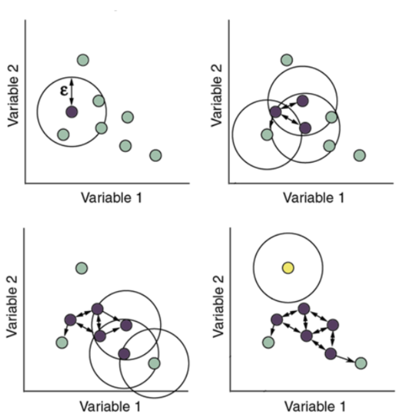

# FROM 세범'S CODE
https://colab.research.google.com/drive/1r4nYdn6YeRIEpeltpvZI1NP1Iq9uclaA

🌱 군집 알고리즘으로 알고 있는 DBSCAN을 이용해서 이상치를 탐색한 기법이 놀라웠다.


# DBSCAN : 밀도 기반 군집화 알고리즘

<u>비계층적 군집분석 방식</u>으로, "**유사한 데이터는 서로 근접하게 분포할 것이다.**"를 가정을 기반으로 최적의 그룹의 수를 자동적으로 찾는다. 

k-means와 달리 처음에 그룹의 수(k)를 설정하지 않는다. 


## DBSCAN의 작동원리
### 주요 파라미터
- eps: 반지름 거리 (= 이웃으로 볼 거리 기준)
- min_samples: 이웃으로 간주되기 위한 최소 포인트 수

### 어떻게 DBSCAN으로 이상치를 탐색할 수 있었을까? 

- 정상이라고 판단하는 데이터: 근처에 비슷한 포인트가 여러개 있음 

    ➡️ Core / Border
- 이상치라고 판단하는 데이터: 혼자 떨어져 있어서(밀도가 낮은 영역에 있어서) 이웃이 없음 

    ➡️ Noise 


DBSCAN은 세 가지 종류의 포인트로 데이터를 나눈다.

✔️ Core Point: 자기 주변 (반경 eps이내)에 min_samples개 이상 있는 지점

✔️ Border Point: 자기 주변엔 min_sample개 이하로 있지만, 어떤 core point의 이웃에 포함된 지점

✔️ Noise Point: core도 아니고, border도 아닌 어느 군집에도 속하지 않는 지점점



1. 모든 데이터 포인트를 확인하면서 `eps거리 이내` 이웃을 계산
2. 이웃 수가 `min_samples` 이상이면 → Core Point로 간주
3. Core Point에서 시작해서 인정한 Core ~ Border Point를 계속 연결하면서 하나의 군집을 형성한다.
4. 이때 어느 군집에서 속하지 못한 포인트는 Noise로 분류된다.

### 최적의 eps는 어떻게 설정할까?
k-거리 그래프를 그려 확인해본다.


각 점에서 k번째로 가까운 이웃 거리를 구해서 그래프를 그렸을 때, 거리가 갑자기 멀어지는 점의 거리를 찾아 그 거리를 기준 epsilon으로로 설정한다.

➕ k = min_samples-1이다
- min_samples는 자기를 포함한 수
- min_samples에서 자기를 제외한 이웃의 수 

---

# FROM 지민's CODE

https://colab.research.google.com/drive/1fZorMwurEITrZJrrS6Dsn6PU4OyPukl8?usp=sharing

## 컬럼 이해의 중요성

🌱 이 코드에서는 컬럼에 대한 이해가 매우 중요함을 한 번 더 상기할 수 있었다.

- 내 코드와 달리 결측치가 너무 많은 컬럼들은 제거하는 방식으로 결측치를 처리했다.

- 하지만  PoolQC이나, MiscFeature 같은 변수들에서의 NaN값은, 해당 옵션이 없는 집을 의미하는 것이므로, 결측치는 사실 유의미한 값을 설명하고 있었다다.

- 따라서, 분석에 앞서서 컬럼에 대한 사전 지식과 이해가 매우매우 중요함을 한 차례 더 상기하였다.

🌱 또한, 컬럼에 대한 이해는 범주화 단계에도 매우 중요한 단계임을 확인했다.

- 예를 들어, 값이 0 혹은 1로 나누어지는 변수라면 이후에 이진분류로 범주화가 가능할 것이고, 월(month)과 같은 변수들은 얼핏보면 수치형처럼 보이지만 시계열 분석이 아닌 단순 분석에서는 대부분 범주형으로 활용하는 것처럼 변수에 대한 이해와 지식이 중요함을 한 번 더 확인했다.

    -  평점과 같은 경우의 컬럼은 1점 < 2점 < .. < 5점과 같이 순서나 위계가 있는 변수로, 범주형 중에서도 순서형 범주형 변수이다. 
    - 이런 형식의 변수는 각 범주에 숫자값을 부여해서 순서 정보가 유지 될 수 있는, label encoding방식을 사용한다.


## Blending
앙상블의 한 종류로, **서로 다른 모델들의 예측값을 가중합하는 방식**이다. 

**코드 예시**
```python
def blend_models_predict(X, b, c, d):
    return ((b * xgb.predict(X)) + 
            (c * lgbm.predict(X)) + 
            (d * cb.predict(X)))
```

- xgb, lgbm, catboost :  훈련된 모델
- b,c,d: 각 모델에 줄 가중치

    → 최종 예측은 b * xgb + c * lgbm + d * cb의 가중 평균

### 가중치는 어떻게 설정할까?

1. 직접 수동 조정

    가중치들의 합이 1이 되도록 수동으로 설정한다.
    - 보통 성능이 좋은 모델에 더 높은 가중치를 부여한다
        - RMSE / MAE가 낮은 모델일 수록 신뢰할 수 있는 모델로 판단
    - validation 성능이 균형되게 나오도록 하는 조합으로 실험해본다
        - 앙상을을 하면 각각의 모델이 서로 보완적 역할을 하는 경우가 있다
        - 예를 들어 A는 이상치에 강하고, B는 평균적 예측력이 좋고,
        - 이러한 경우에는 일정비율을 균등분배하면서 점진적으로 조정한다. (수동 방법 중 가장 권장되는 방법)
2. Grid Search

    `가중치의 합이 1이라는 조건하`에서 가능한 조합을 모두 탐색해서 최적의 해를 찾는다.

    - 체계적이지만 시간이 너무 오래걸림

3. Optuna

    목표지표(RMSE,MAE)를 자동 최소화하는 가중치 조합을 탐색한다. 

#### Grid Search vs Optuna 비교 요약표

| 항목 | **Grid Search** | **Optuna** |
|------|------------------|------------|
| **탐색 방식** | 모든 조합을 전수조사 (Brute-force) | 좋은 조합을 중심으로 탐색 (Bayesian Optimization 계열) |
| **속도** | 느림 (조합 많을수록 지수적으로 증가) | 빠름 (필요한 조합만 효율적으로 탐색) |
| **연속값 탐색** | 어려움 (정해진 간격만 가능, 예: 0.1 단위) | 매우 강력 (float 범위에서 자유롭게 최적화) |
| **구현 난이도** | 쉬움 (단순한 반복문) | 중간 (Optuna 설치 및 `objective` 함수 구현 필요) |
| **하이퍼파라미터 수가 많을 때** | 매우 비효율적 | 효율적 |
| **결과 최적화 정확도** | 제한적 (조합 범위 내 최적만 가능) | 더 정밀한 최적값 도달 가능 |
| **활용 사례** | 단순 모델 튜닝, 빠른 테스트 | 복잡한 모델 최적화, AutoML, blending 가중치 조정 등 |

---

#### 상황별 추천

| 상황 | 추천 방법 |
|------|------------|
| 조합이 단순하고 실험 범위가 명확할 때 | ✅ Grid Search |
| float 가중치, 연속값 튜닝이 필요할 때 | ✅ Optuna |
| 모델 수가 많고, 다양한 조합 실험 필요 | ✅ Optuna |
| 코드 구현이 간단해야 하거나 초기에 baseline을 잡을 때 | ✅ Grid Search |
| 성능이 중요한 실무/대회 상황 | ✅ Optuna |
