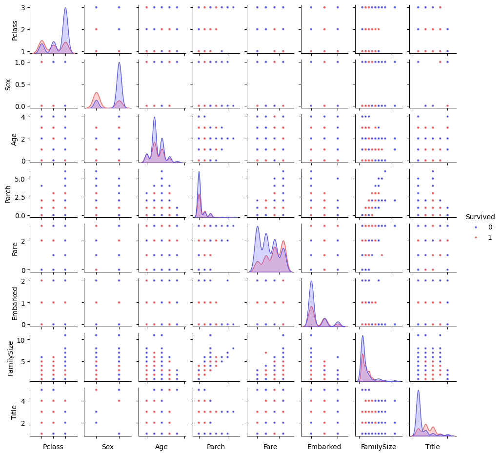

# 🌱배운 점
## from my code
 - 항상 습관처럼 하던 `.describe`를 통해서도 기본적인 정보를 추출할 수 있다는 점에서 놀랐고, 이후에 코드를 볼 때마다 정보를 이끌어내려고 노력하고 있다.

 - 전체적인 데이터 흐름을 한 번 더 정리할 수 있는 기회였다.

- 인코딩을 하는 부분에서 random forest와 같은 종류에서의 분류모델은 라벨 인코딩을 했을 때의 순서/크기 의미가 생성되는것이 큰 영향이 없기에 사용해도 무관하다는 것을 알게 되었다

- pivot_table만들기
    > `.groupby`함수 사용하기
    ```python
    #예시
    ## Parch별 생존률
    train_df[['Parch','Survived']].groupby(['Parch'], as_index=False).mean().sort_values(by='Survived', ascending=False)
    ```    

## from members' code

## 세범's code
https://github.com/ksb7762-k/Dart-B/blob/main/%EC%BA%90%EA%B8%80%EC%8A%A4%ED%84%B0%EB%94%94/%ED%83%80%EC%9D%B4%ED%83%80%EB%8B%89%ED%95%84%EC%82%AC%EC%BD%94%EB%93%9C.ipynb

✔️ 여러 종류의 그래프들을 볼 수 있었다. 
    - 바이올린플롯
    - 파이차트
    - 막대차트

✔️ 제거하고 생성한 변수가 달라서 다른 관점에서 데이터를 바라 볼 수 있었다.    


✔️ 모델별로 confusion matrix를 한 눈에 비교했는데, 목적에 맞는 모델을 TN과 FP에 맞게 선택해야하는 경우에 좋은 방법이라고 생각했다.

✔️ 내가 사용한 모델외에도 다양한 모델들을 사용했는데, Radial Svm의 성능이 내 코드에서 성능이 가장 좋았던 Random Forest보다 더 높게 나와서 공부해봤다.

## 🤖 Radial SVM

```
Radial SVM = SVM + RVF커널
```

**SVM의 핵심 아이디어**
- 두 클래스 사이의 경계를 최대한 멀리 벌리자 (= 뚜렷하게 구분되도록 하자)
- <u>선형으로 구분이 안되는 경우</u>, **커널을 이용해 고차원으로 매핑**해서 분리한다

**Radial의 개념**
> 비선형 데이터를 잘 분리해주는 커널 함수

- 포인트 사이의 거리를 기반으로 값을 계산함.

##  Radial SVM이 좋은 점

| 장점 | 설명 |
|------|------|
| ✅ 비선형 데이터 분리에 강함 | 고차원으로 매핑해서 선형으로 분리 가능 |
| ✅ 적당한 성능 | 대부분의 데이터셋에서 튼튼하게 작동 |
| ✅ 범용성 | 이미지, 텍스트 등 다양한 분야에 사용 가능 |

##  SVM에서 자주 쓰는 커널 종류

| 커널 종류 | 특징 |
|-----------|------|
| Linear    | 선형 분리 가능한 경우 |
| Polynomial| 다항식 형태로 매핑 |
| **RBF (Radial)** | **비선형 분리에 강력. 가장 많이 쓰임** |
| Sigmoid   | 신경망과 유사한 효과 |

---

## 지민's code


- 범주형 변수에서도 pairplot을 사용한다는 것을 알게 되었고, 대각선 플롯만 다른 종류의 그래프로 설정이 가능한 것을 배웠다.
    ```python
    #변수 간 관계를 한 눈에 보기 위해 seaborn.pairplot 을 이용해 시각화
    g = sns.pairplot(train[[u'Survived', u'Pclass', u'Sex', u'Age', u'Parch', u'Fare', u'Embarked',
        u'FamilySize', u'Title']], hue='Survived', palette = 'seismic',size=1.2,diag_kind = 'kde',diag_kws=dict(shade=True),plot_kws=dict(s=10) )
    g.set(xticklabels=[])
    ```

- 여러개의 모델을 반복적으로 실행할 때 `class`로 함수를 생성해서 효율적으로 한 방식이 인상깊었다.


---


 # 🫧개인적 의문점
 해당 코드는 EDA를 하고 모델링을 위한 변수를 선택한 뒤에야 결측치를 처리하는 흐름을 보이고 있다.

 나는 결측치를 처리한 후에 EDA를 진행해야 옳은 시각화, 가설 검증 및 통게적 검증을 걸쳐 모델링에 필요한 적절한 변수가 정해진다고 생각해서 이 흐름에 의문이 있다라는 것을 공유했다.

 한 스터디원은 이러한 흐름으로 가는 것이 시간이 절약되어 효율적인 흐름인 것 같다는 의견을 제시했다.

 - 결측값을 보완하는 새로운 방법도 알게 되었다.
    - 상관특징 기반 중앙값 대처법

- age_band * Pclass 변수를 새로 만들었는데 사실 그의 의도를 충분히 파악하진 못했다

또 다른 스터디원의 "만약 age_band가 아닌 age * Pclass였다면 그 의도를 좀 더 잘 파악할 수 있었을 것 같다." 라는 의견에 공감했다.
 


